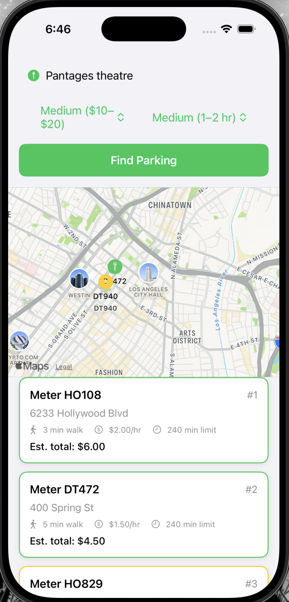

# Frontend

## Directory tree

```
Frontend/
├── Assets.xcassets/
├── Models/
│   ├── Coordinate.swift
│   ├── RankedResults.swift
│   ├── ScoredSpot.swift
│   ├── UserPreferences.swift
│   └── UserQuery.swift
├── PetrParkingApp.swift
├── Services/
│   ├── APIClient.swift
│   └── SessionManager.swift
├── Utils/
│   └── Theme.swift
├── ViewModels/
│   └── ParkingViewModel.swift
└── Views/
    ├── ContentView.swift
    ├── MapView.swift
    ├── MeterPinView.swift
    ├── PreferencesView.swift
    ├── ResultsListView.swift
    ├── SearchFormView.swift
    └── SpotCardView.swift
```

Also at the project root:
- **`LA.gpx`** — Xcode location simulation file for testing GPS-dependent features without being in LA (see [Location Simulation](#location-simulation-lagpx)).

---

## PetrParkingApp.swift

The entry point for the app. Sets `ContentView` as the root view in the app entry: `WindowGroup`.

---

## Models

The Models layer holds the swift models used for query handling, API requests/responses, the personal model, and frontend output display. 

### Coordinate.swift

Defines a **Codable wrapper for `CLLocationCoordinate2D`**. To properly handle API responses and requests, the user's current location needs to be `Codable` to be easily converted to and from JSON representation (i.e. `{ lat: float, lng: float }`); `CLLocationCoordinate2D` is not `Codable`, so this `Coordinate` struct wraps around `CLLocationCoordinate2D` to address this limitation. The attribute `clLocation` is used with MapKit and other APIs that expect `CLLocationCoordinate2D`.

| Parameter    | Type                     | Notes                                                                        |
| ------------ | ------------------------ | ---------------------------------------------------------------------------- |
| `lat`        | `Double`                 | Latitude.                                                                    |
| `lng`        | `Double`                 | Longitude.                                                                   |
| `clLocation` | `CLLocationCoordinate2D` | Computed; use for MapKit and other APIs expecting `CLLocationCoordinate2D`.  |

### RankedResults.swift

Represents the **response from the backend search endpoint**: a ranked list of recommended parking spots accompanied by candidate evaluation and query timestamp metadata. Contains the array of `ScoredSpot` items (containing information needed for the results panel and map pins), the number of candidates evaluated before filtering and ranking, and the timestamp of the query prompting the ranked results to be delivered in the first place. Conforms to `Equatable` for use in `ParkingUIState`.

| Parameter                  | Type           | Notes                                                               |
| -------------------------- | -------------- | ------------------------------------------------------------------- |
| `spots`                    | `[ScoredSpot]` | Ranked score cards (best match first); consists of information needed for accurately displaying ranked results info in the ranked results panel and map view pins. |
| `totalCandidatesEvaluated` | `Int`          | Number of candidate spots considered before filtering/ranking.       |
| `queryTimestamp`           | `Date`         | Time the query was processed (matches `UserQuery.currentTime`).      |

### ScoredSpot.swift

Models a **ranked parking spot in the ranked list**, visually displayed as a score card in the ranked list. Comprises information related to a ranked parking spot and color code information for card display purposes. Includes ranked parking spot information like `spaceid`, meter address, walk time, hourly rate, estimated total cost, time limit, rank, and real-time occupancy status. `colorCode` (green / yellow / orange) drives card styling. Optional backend score fields are included when provided. Also consists of latitude and longitude information for map pin display purposes, where those coordinates are converted to `CLLocationCoordinate2D` for MapView pins. Optional backend score fields like price score, walk time score, and total score are included when provided. 

**ColorCode** (enum): `green` = highly recommended; `yellow` = good; `orange` = acceptable. Provides `color: Color` for SwiftUI.

| Parameter                                       | Type                     | Notes                                                             |
| ----------------------------------------------- | ------------------------ | ----------------------------------------------------------------- |
| `spaceid`                                       | `String`                 | Meter identifier (e.g. "HO108"); from LADOT data.                 |
| `meterAddress`                                  | `String`                 | Street address of the meter (e.g. "6233 Hollywood Blvd").         |
| `latitude`, `longitude`                         | `Double`                 | For map pin placement.                                            |
| `walkTime`                                      | `Int`                    | Walk time to destination in minutes (~80 m/min walking speed).    |
| `rate`                                          | `Double`                 | Hourly rate ($/hr).                                               |
| `estimatedTotalCost`                            | `Double`                 | Estimated total cost for the user's stay (rate × duration).       |
| `timelimit`                                     | `Int`                    | Max allowed parking duration in minutes.                          |
| `rank`                                          | `Int`                    | Position in ranked list (1 = best match).                         |
| `colorCode`                                     | `ColorCode`              | Card color: green / yellow / orange by recommendation strength.   |
| `occupancy`                                     | `String`                 | Baseline occupancy at search time: "VACANT", "OCCUPIED", or "UNKNOWN". |
| `priceScore`, `walkTimeScore`, `totalScore`     | `Double?`                | Optional backend scoring components; for display or debugging.    |
| `id`                                            | `String`                 | Computed; equals `spaceid` (for `Identifiable`).                   |
| `coordinate`                                    | `CLLocationCoordinate2D` | Computed; for MapView pins.                                        |

### SearchRequest.swift

Deprecated `Codable` struct that pairs a `UserQuery` with `UserPreferences` for a POST body. Kept for potential future use; the current implementation uses GET with query params.

### UserPreferences.swift

Represents the personal model. Defines two attributes in the personal model: `BudgetRangePreference` and `StayTimePreference`. The `UserPreferences` struct stores these two attributes.

**BudgetRangePreference** (enum): `low` = $0–$10; `medium` = $10–$20; `high` = $20–$50. Conforms to `String`, `Codable`, `CaseIterable`. Used in parking spot scoring, where parking spots with a final total price that correlates most closely to the chosen range are prioritized in ranking.

**StayTimePreference** (enum): `short` = 0–60 min; `medium` = 60–120 min; `long` = 120–240 min. Filters out spots with inadequate time limits. Conforms to `String`, `Codable`, `CaseIterable`. Used in parking spot scoring, where parking spots with a time limit that correlates most closely to the chosen range are prioritized in ranking.

**UserPreferences** — the personal framework. Budget range and stay duration are persistently stored across sessions via `SessionManager`. Also embedded directly in `UserQuery` so preference context travels with each search request.

| Parameter      | Type                    | Notes                                                                        |
| -------------- | ----------------------- | ---------------------------------------------------------------------------- |
| `budgetRange`  | `BudgetRangePreference` | Budget range category; influences price weight in ranking.                             |
| `stayDuration` | `StayTimePreference`    | Stay duration category; influences time-limit weight in ranking.                       |

### UserQuery.swift

Represents the query augmented with personal model information and contextual signals, serving as the definintive model for the query processing pipeline. `currentLocation` is the context signal auto-captured at query time while `preferences` represents the personal model information correlating to the user.

| Parameter       | Type              | Notes                                                               |
| --------------- | ----------------- | ------------------------------------------------------------------- |
| `targetLocation`| `String`          | Free-text destination; geocoded by backend.                         |
| `currentLocation`| `Coordinate`     | User's current GPS position; Codable via Coordinate wrapper. Sent to the backend; ranking uses it to nudge results toward spots geographically closer to the user. |
| `currentTime`   | `Date`            | Auto-captured at query time; ISO 8601 for API.                      |
| `preferences`   | `UserPreferences` | Budget range and stay duration for this search; info sourced from SessionManager. |

---

## Services

### APIClient.swift

Handles all communication between the iOS app and the FastAPI backend. Singleton (`APIClient.shared`) that formats and encodes requests, sends asynchronous network calls, and decodes responses.

**Methods:**

- **`searchParking(query:)`** — `GET /meters/search`; builds query params from `UserQuery` (including `query.preferences` for budget and stay), decodes response as `RankedResults`. Budget preference and stay duration preference from personal model added to personal model. Also, current occupancy of candidate parking spots used as contextual signal to filter out occupied parking spots from candidates searched for (logic occurs in the backend). 
- **`fetchOccupancy(spaceids:)`** — `GET /meters/occupancy?spaceids=...`; accepts an array of space IDs and returns a `[String: String]` dict mapping each to its current occupancy state (`"VACANT"`, `"OCCUPIED"`, or `"UNKNOWN"`). Called by `ParkingViewModel` on a 7-second polling interval during an active journey.
- **`resetMockOccupancyOverrides()`** — Clears all mock occupancy overrides; called automatically at the start of each new search if the app is currently in mock mode.

**Mock mode:**

Set `useMockMode = true` (line 19) to bypass the backend entirely. All network calls return hardcoded data:
- `searchParking` returns 5 predefined LA parking spots after an 800 ms simulated delay.
- `fetchOccupancy` returns the state from `mockOccupancyOverrides` for each space ID, defaulting to `"VACANT"` for any ID not in the override dict.

**`mockOccupancyOverrides: [String: String]`** — Per-spot occupancy state overrides populated by the in-app mock debug panel (visible only when `useMockMode = true`). Allows testers to manually flip any spot to `"OCCUPIED"` or `"UNKNOWN"` to exercise the full occupancy-transition UI flow without live LADOT data.

### SessionManager.swift

Singleton **session manager** that manages the `UserPreferences` information in `UserDefaults`, where `UserPreferences` is persistently stored. The session manager enables personal model information to persist by managing this information (i.e. user preferences) persistently between app sessions. On launch, stored preferences are loaded and used to prefill the search form pickers. `ParkingViewModel` reads from `SessionManager.userPreferences` when constructing `UserQuery` so the backend always receives the user's stored budget range and stay duration range preference values.

| Attribute          | Type              | Notes                                                                                         |
| ------------------ | ----------------- | --------------------------------------------------------------------------------------------- |
| `shared`           | `SessionManager`  | Singleton instance; provides global access throughout the app.                                |
| `userPreferences`  | `UserPreferences` | Published budget and stay preferences; persisted to `UserDefaults` and logged on every change. |

---

## Utils

### Theme.swift

Static color palette for the app. Variables can be changed to restyle the entire app. Key values: `primary` (black), `primaryInverse` (white), `accent` (blue `#0055C7`), `secondaryText` (gray), `cardBackground` (white), `cardShadow`, `divider`, `pinHighlight` (accent blue).

---

## ViewModels

### ParkingViewModel.swift

Single source of truth for the main search and real-time journey flow. Marked `@MainActor` so all state mutations happen on the main thread. Views interact with this ViewModel as an intermediary to leverage Models for data handling and processing.

#### ParkingViewModel Components

**ParkingUIState** (enum): comprises all the potential UI states that the frontend can go through.

| Case                               | Description                                                         |
| ---------------------------------- | ------------------------------------------------------------------- |
| `.initial`                         | Empty state before any search.                                      |
| `.loading`                         | Search in progress; form disabled, spinner shown.                   |
| `.results(RankedResults)`          | Ranked spots shown; map pins visible; results panel shows parking spot cards; occupancy polling active.     |
| `.noResults`                       | No spots found; suggest expanding radius.                           |
| `.error(String)`                   | Failure with message; retry option.                                 |
| `.journeyComplete(JourneySummary)` | Journey ended; results panel shows the journey summary screen.      |

**JourneySummary** (struct): snapshot produced by `endJourney()` capturing the full record of a completed journey.

| Attribute         | Type           | Description                                                                                     |
| ----------------- | -------------- | ----------------------------------------------------------------------------------------------- |
| `chosenSpots`     | `[ScoredSpot]` | Chronological list of every spot the user selected during the journey.                          |
| `finalSpot`       | `ScoredSpot?`  | The last spot in `chosenSpots`; the spot the user was navigating to when the journey ended.     |
| `startTime`       | `Date`         | Timestamp when the first ranked results appeared (i.e. when the journey began).                 |
| `endTime`         | `Date`         | Timestamp when the user tapped "End Journey".                                                   |
| `durationMinutes` | `Int`          | Total elapsed time (in minutes) from `startTime` to `endTime`.                                  |

**Location tracking — `LocationDelegate`:** A private `NSObject` / `CLLocationManagerDelegate` bridge class defined in the same file. Helps capture the current location context signal. Required because `CLLocationManagerDelegate` is an Objective-C protocol that cannot be adopted directly by an `@MainActor`-isolated class, which is what `ParkingViewModel` is. The delegate forwards `didUpdateLocations` and `didChangeAuthorization` callbacks back to the `ParkingViewModel`, the main actor, via closures.

| Closure                  | Signature                              | Role                                                                                                  |
| ------------------------ | -------------------------------------- | ----------------------------------------------------------------------------------------------------- |
| `onLocationUpdate`       | `(CLLocation) -> Void`                 | Invoked with the most recent device position each time `didUpdateLocations` fires (i.e. a new device position is recorded); updates `currentLocation` on the view model. |
| `onAuthorizationChange`  | `(CLAuthorizationStatus) -> Void`      | Invoked when the app's location permission status changes via `didChangeAuthorization`, enabling `ParkingViewModel` to react appropriately to authorization change; triggers re-request if needed. |

#### ParkingViewModel

**Published Properties:**

| Property                | Type                          | Description                                                              |
| ----------------------- | ----------------------------- | ------------------------------------------------------------------------ |
| `uiState`               | `ParkingUIState`              | Indicates what the current UI state is, driving the results panel and map.                                            |
| `targetLocation`        | `String`                      | Free-text destination where user want to park nearby. Entered in the search form.                              |
| `budgetRangePreference` | `BudgetRangePreference`       | Picker value associated with user's budget range preference; synced with SessionManager to sync this preference with personal model.                                |
| `stayTimePreference`    | `StayTimePreference`          | Picker value assocaited with user's stay time duration preference; synced with SessionManager to sync this preference with personal model.                                |
| `currentLocation`       | `CLLocationCoordinate2D?`     | Context signal that represents live GPS position; updated continuously via `LocationDelegate`. Sent to the backend for ranking, which uses it to nudge toward spots geographically closer to the user.          |
| `currentTime`           | `Date`                        | Represents the present time captured at search invocation.                                       |
| `selectedSpotID`        | `String?`                     | `spaceid` of the currently selected parking spot; indicates which route on map to draw and card to highlight on UI.      |
| `liveOccupancy`         | `[String: String]`            | Latest polled occupancy status for each currently ranked spot; keyed by `spaceid`. Contextual signal used by system to filter out occupied spots from current ranking (visually depicted to user as "grayed out" parking spot cards).        |
| `selectedRoute`         | `MKRoute?`                    | Driving route computed by `calculateRoute(to:)` via `MKDirections`; read by `MapView` and rendered as a blue polyline. `MapView` does not calculate the route — it only renders this value. `MKDirections` returns routes sorted by relevance/quality, so `routes.first` is Apple's recommended route rather than strictly the fastest. |
| `showSpotOccupiedAlert` | `Bool`                        | True when the selected spot transitions VACANT → OCCUPIED; triggers occupancy alert.|
| `journeyHistory`        | `[ScoredSpot]`                | Record of Every spot the user selected during the active journey, in order. Includes duplicates to show entire history.        |

**Computed properties:**

- `mapCenter` — `currentLocation ?? laCenter`
- `hasResults` — true when `uiState == .results`
- `rankedResults` — the `RankedResults` payload when in `.results` UI state, otherwise `nil`
- `hasAnyVacantRankedSpots` — true if at least one non-selected ranked spot has live occupancy other than `"OCCUPIED"`; used to decide whether the occupancy alert requires prompting the user to begin a new journey or allowing the user to select the next best available parking spot.

**Key methods:**

| Method                         | Description                                                                                                     |
| ------------------------------ | --------------------------------------------------------------------------------------------------------------- |
| `searchParking(preserveHistory:)` | Stops polling, clears current selection/route/occupancy, and re-runs the parking search. When `preserveHistory: false` (default — "Begin Journey" button, `retry()`), also clears `journeyHistory` and `journeyStartTime` for a fresh journey. When `preserveHistory: true` ("Find More Parking" alert action), retains both so the full history across re-ranks is preserved and original journey start time carry into the eventual journey summary. `journeyStartTime` is only stamped if it was nil. |
| `selectSpot(_ spot:)`          | Sets `selectedSpotID` as the given spot, appends spot to `journeyHistory`, triggers `calculateRoute(to:)` which calls `MKDirections` and stores Apple's recommended route (sorted by relevance/quality, not strictly fastest) in `selectedRoute` for `MapView` to render. |
| `deselectSpot()`               | Clears `selectedSpotID` and `selectedRoute`.                                                                    |
| `selectNextBestUnoccupiedSpot()`   | Selects the highest-ranked non-occupied, non-selected spot; called by the "Select Next Best" alert action.      |
| `startOccupancyPolling()`      | Starts a background `Task` loop that calls `refreshOccupancy()` every 7 seconds.                               |
| `stopOccupancyPolling()`       | Cancels the polling task.                                                                                       |
| `refreshOccupancy()`           | Private async core of the polling loop. Fetches latest occupancy for all ranked spots, logs a full snapshot to the console, detects VACANT→OCCUPIED transitions on the selected spot (triggering the `showSpotOccupiedAlert`), and updates `liveOccupancy` with values retrieved by the latest occupancy poll, enabling each spot to retain its last known live occupancy value if it temporarily drops out of a poll response. Called by `startOccupancyPolling` on a 7-second interval and by `triggerMockOccupancyRefresh` on demand. |
| `triggerMockOccupancyRefresh()`| Forces an immediate occupancy refresh outside the polling cycle; used by the mock debug panel.                  |
| `endJourney()`                 | Stops polling, captures a `JourneySummary`, clears navigation state, transitions to `.journeyComplete`.         |
| `resetToInitial()`             | Stops polling, clears all state, transitions to `.initial`.                                                     |
| `retry()`                      | Re-runs `searchParking()`.                                                                                      |
| `updateBudgetPreference(_ newValue:)`   | Saves budget picker change to SessionManager.                                                                   |
| `updateStayDurationPreference(_ newValue:)` | Saves stay-duration picker change to SessionManager.                                                        |

---

## Views

The Views layer implements the UI described in the proposal: search form, map, and ranked results panel (Uber-style layout). All main views observe `ParkingViewModel` and reflect its state (initial, loading, results, no results, error).

### ContentView.swift

Root container. Vertical stack: **SearchFormView** → **Divider** → **MapView** (280 pt fixed height) → **Divider** → **ResultsListView** (fills remaining space). Interacts with a single `@StateObject ParkingViewModel`. Disables the search form while loading.

**Occupied-spot alert:** A `.alert` modifier on the outer `VStack` that binds to `viewModel.showSpotOccupiedAlert`. When the selected spot transitions VACANT → OCCUPIED during a live journey, the alert appears with:
- **"Select Next Best"** — only shown if `viewModel.hasAnyVacantRankedSpots` is true; calls `viewModel.selectNextBestVacantSpot()`.
- **"Find More Parking"** — always shown; calls `viewModel.searchParking(preserveHistory: true)` to re-rank while retaining the full `journeyHistory` and original `journeyStartTime`, so the eventual journey summary reflects all spots selected across every re-rank.
- **"Dismiss"** — cancel action.

### SearchFormView.swift

Search input area. **TextField** for destination, **Pickers** for budget range and stay time, and a **"Begin Journey"** button to find parking spots for the intended destination. A journey is defined as the time from when ranked results are delivered to when the user no longer needs the results (prompted by clicking **"End Journey"** in `ResultsListView`). Pickers prefill from stored preferences; `.onChange` handlers ensure changes persist and are saved to personal model. Button disabled when destination is empty or state is loading.

### MapView.swift

SwiftUI **Map** (MapKit) with real-time user location and route rendering.

- **`UserAnnotation()`** — always-visible blue dot showing the user's live GPS position.
- **Spot pins** — `MeterPinView` annotation for each ranked spot when results are available.
- **Route polyline** — renders `viewModel.selectedRoute` as a blue `MapPolyline` (lineWidth 4). `MapView` is purely responsible for display; the route is calculated in `ParkingViewModel.calculateRoute(to:)` via `MKDirections` and stored in `selectedRoute`, which `MapView` reads and draws.
- **Dynamic camera:** `@State private var position: MapCameraPosition` initialises to Downtown LA. Three independent `onChange` handlers drive camera movement:
  - **GPS fix** (`onChange(of: viewModel.currentLocation)`): on the first GPS fix the camera re-centres on the user's position; `hasCenteredOnUser` guards this so it only fires once and subsequent panning is left to the user.
  - **New search results** (`onChange(of: viewModel.rankedResults)`): whenever a new ranked list arrives the camera zooms to a bounding region that fits all ranked pins, ensuring no spot is out of frame regardless of where the user is. The bounding region is derived from the min/max latitude and longitude of all spot coordinates with a 1.5× padding factor to prevent pins from being clipped at the frame edges.
  - **Route selected** (`onChange(of: viewModel.selectedRoute)`): whenever a new route is set (i.e. the user taps a spot card), the camera pans and zooms to fit the entire route polyline so both the user's current location and the destination pin are simultaneously visible. The fit is derived from `route.polyline.boundingMapRect` expanded by 25% on each side to keep endpoints away from the frame edge.
- **`CLLocationCoordinate2D: @retroactive Equatable`** — conformance extension added at the top of this file so `onChange(of: viewModel.currentLocation)` can differentiate successive GPS fixes (required because `CLLocationCoordinate2D` is a C struct that does not synthesize `Equatable`).

### ResultsListView.swift

Bottom panel switching on `viewModel.uiState`:

| State                  | Content                                                                                                        |
| ---------------------- | -------------------------------------------------------------------------------------------------------------- |
| `.initial`             | Map icon + "Enter a destination and tap Find Parking".                                                          |
| `.loading`             | `ProgressView` + "Searching for spots…".                                                                       |
| `.results`             | "End Journey" button + optional mock debug panel + scrollable `LazyVStack` of `SpotCardView` cards.            |
| `.noResults`           | "No spots found" message + Retry button.                                                                       |
| `.error`               | Warning icon + error message + Retry button.                                                                   |
| `.journeyComplete`     | Journey summary screen (see below).                                                                            |

**Spot selection:** each `SpotCardView` in the results list receives `isSelected`, `liveOccupancy`, and an `onTap` closure. Tapping a card calls `viewModel.selectSpot` (or `viewModel.deselectSpot` if the same card is tapped again), which updates the highlighted card and recalculates the map route.

**End Journey button:** appears above the card list in `.results` state. Calls `viewModel.endJourney()`, which stops polling and transitions to `.journeyComplete`.

**Journey complete view (`journeyCompleteState`):** displayed when `uiState == .journeyComplete(summary)`. Shows:
- Header with checkmark icon, "Journey Complete" title, journey duration in minutes, and start/end times (time-of-day only, e.g. "9:41 AM").
- Numbered chronological list of all spots the user selected (`summary.chosenSpots`).
- Full read-only `SpotCardView` for `summary.finalSpot`.
- "Start New Journey" button calling `viewModel.resetToInitial()`.

**Mock debug panel (`mockDebugPanel`):** visible only when `APIClient.shared.useMockMode == true`. A compact (60 pt tall, scrollable) orange-tinted panel above the card list with a 3-way segmented picker (VACANT / OCCUPIED / UNKNOWN) per ranked spot and a "Reset All" button. Changes apply immediately via `viewModel.triggerMockOccupancyRefresh()`. Enables testing all occupancy-transition scenarios without live LADOT data:

| Testable Scenario | How to trigger |
| --- | --- |
| Selected spot → OCCUPIED, "Select Next Best" available | Select a card; flip that spot to OCCUPIED in panel |
| Selected spot → OCCUPIED, no vacancies remain | Select a card; flip all spots to OCCUPIED |
| Unselected spot → OCCUPIED (gray-out, no alert) | Flip a non-selected spot to OCCUPIED |
| OCCUPIED unselected spot restores | Flip an OCCUPIED unselected spot back to VACANT or UNKNOWN |

### SpotCardView.swift

Single score card for one `ScoredSpot`.

**Signature:**
```swift
SpotCardView(spot: ScoredSpot, isSelected: Bool, liveOccupancy: String?, onTap: () -> Void)
```

**Visual states:**
- **Default:** border color from `spot.colorCode.color` (green / yellow / orange).
- **Selected:** accent-blue border, lineWidth 4.
- **Occupied:** gray background (`Color.gray.opacity(0.3)`) and gray border.

**Occupancy badge:** displayed in the info HStack alongside walk time, rate, and time limit.
- `"VACANT"` → green text
- `"OCCUPIED"` → red text
- `"UNKNOWN"` → remapped to `"NO OCCUPANCY DATA"` in neutral gray — explicitly communicates that the absence of status is a LADOT sensor coverage gap, not an app error.

The badge uses `effectiveOccupancy` (live-polled value if available, otherwise `spot.occupancy` from the search response) and `occupancyLabel` / `occupancyLabelColor` computed properties for display. `effectiveOccupancy` provides a fallback in case no live polling is able to take place.

### MeterPinView.swift

Map annotation content for each ranked spot. Shows a filled mappin SF Symbol tinted with `spot.colorCode.color` and labeled with the spot's `spaceid` in caption text.

### PreferencesView.swift

Placeholder for a future preferences screen. Currently renders `Text("Preferences")` only.

---

## Occupancy Polling

Once search results arrive, `ParkingViewModel` starts a background polling loop (every 7 seconds) that calls `GET /meters/occupancy` with the space IDs of all ranked spots. On each response:

1. The `liveOccupancy` dict is updated with the fresh values.
2. Each `SpotCardView` re-renders with the updated occupancy badge and visual state.
3. If the currently selected spot transitions from VACANT to OCCUPIED, `showSpotOccupiedAlert` is set to `true`, triggering the occupied-spot alert in `ContentView`.

Polling stops automatically when the user taps "End Journey", the user taps the "Begin Journey" button in the search form, taps "Find More Parking" in the occupied-spot alert, or the system calls `resetToInitial()`.

**Occupancy console logging:** every poll prints a timestamped summary to the Xcode debug console (Swift client) and the FastAPI server terminal (Python backend), showing each space ID, its status, which spot is selected (`◀ selected`), and a warning if the selected spot just became occupied.

**Note on LADOT sensor coverage:** The LADOT Occupancy API only covers meters with IoT sensors installed. Many meters in the inventory dataset have no sensor, so `get_occupancy` returns no entry for them. These appear as `"UNKNOWN"` in the backend response and are displayed as `"NO OCCUPANCY DATA"` in the UI so this information is presented in a user-friendly way. This is a known limitation of the LADOT open data platform, not a bug in the app.

---

## Location Simulation (`LA.gpx`)

Because the app is scoped to Los Angeles, `LA.gpx` at the project root provides a Xcode location simulation preset for testing GPS-dependent features (user location dot, camera re-centering, route polyline) without being physically in LA.

**Setup:**
1. In Xcode: **Product → Scheme → Edit Scheme…** (⌘<)
2. Select **Run** → **Options** tab
3. Under **Core Location**, check **Allow Location Simulation**
4. Set **Default Location** to `LA.gpx` via the dropdown → "Add GPX File to Project…"

After setup, every run automatically simulates a GPS fix at Downtown LA (34.0522, −118.2437).

---

## Troubleshooting

### Backend Connection Issues

If the app shows a connection error, loading spinner that never completes, or "no results" when testing with real backend (`useMockMode = false`), the backend server has likely stopped running.

**Common causes:**
- Closed the terminal window where the server was running
- Computer went to sleep or was restarted
- Accidentally pressed Ctrl+C in the server terminal

**To check if the backend is running:**
```bash
ps aux | grep uvicorn
```

If you only see the `grep` command itself (no `uvicorn` process), the server is not running.

**To restart the backend:**
```bash
cd "/Users/dsetty/College/Classes/CS 125/cs-125"
/Users/dsetty/Library/Python/3.10/bin/uvicorn src.api:app --reload --host 0.0.0.0 --port 8000
```

You should see output like:
```
INFO:     Uvicorn running on http://0.0.0.0:8000 (Press CTRL+C to quit)
INFO:     Started reloader process [####]
INFO:     Application startup complete.
```

**Important:** Keep the terminal window open while testing the app. Closing it will stop the server. If you need to run other commands, open a separate terminal tab (⌘T) instead of closing the server terminal.

---

## Running Frontend

Assuming you have a MacBook Pro and Xcode installed, open `cs-125.xcodeproj` in Xcode. Click the play button to build and run. For UI testing without the backend, set `useMockMode = true` in `APIClient.swift` (line 19).



---
> AI Acknowledgement: AI tools were used during development for implementation support.
